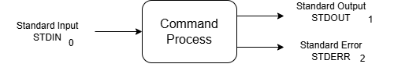

# Learning the Fundamentals

## The Shell 🐚

### Shell 

A `shell` in linux is the interpreter that allows you to interact with the OS. The way commands are interpreted is determined by variables and paramteters associated with each shell. The default shell in linux is `bash`, which stands for "Bourne Again Shell". 

### GUI & CLI
You can access the shell from the `GUI shell interface` then access the terminal. You cn also  open a `virtual CLI` either by connecting a console cable or through SSH.

### Command Syntax

The general syntax of a linux command is
```
COMMAND [OPTIONS] [ARGUMENTS] 
```

>COMMAND --> The program to be executed. \
OPTIONS --> Modify the command behviour \
ARGUMENTS --> The object the command acts

```
# Example

ls -l /home/admin
```
>ls    -- Command \
-l    -- Option \
/home -- argument

#### 1. Traditional Style
Historically, some UNIX commands accepted options without a leading dash.
```
tar xvf backup.tar
```

#### 2. UNIX Style
Short options begin with a single dash - \
Options can be combined together
``` 
ls -l -a
ls -la 
```

#### 3. GNU Style
Long options use a double dash --.

```
ls --all
```
Long options improve readability and self-documentation.

Not all commands follow all three styles. Command syntax depends on the command implementation.

### Command Execution

When you press **Enter**, the shell performs several steps to execute the command.

```text
User
 ↓
Shell reads and parses the command
 ↓
Shell determines the command type
(alias → builtin → executable)
 ↓
Shell searches the command location using PATH
(if needed)
 ↓
Shell creates a new process
 ↓
Kernel loads and runs the program
 ↓
Program executes and produces output
 ↓
Shell displays output and waits for the next command
```

#### Example

```bash
ls -l /home
```

Execution flow:

1. The shell receives `ls -l /home`
2. The shell identifies `ls` as an executable command
3. The shell searches directories listed in `$PATH`
4. The shell creates a new process
5. The kernel loads and runs `/usr/bin/ls`
6. The program executes and generates output
7. The shell prints the output
8. The shell becomes ready for the next command

---

#### Notes

Not every command launches a new executable.

Example:

```bash
cd /tmp
```

`cd` is a **shell builtin**, meaning the shell executes it directly without searching `$PATH`.

You can check command types using:

```bash
type cd
type ls
```

Example output:

```text
cd is a shell builtin
ls is /usr/bin/ls
```

#### Key Takeaways

- The shell interprets and manages command execution.
- The kernel manages process creation and execution.
- Commands can be aliases, builtins, or executables.
- `$PATH` is used to locate executable commands.


## Terminal Commands 

Let's start with simple commands that help us learn more about the terminal.

### Logging commands 1 - whoami | id

`whoami` command tells you on which user you are logged in on.

```
whoami
```
`id` provides information about the user,user ID, groups associated with the user, and the group IDs.

```
id
```

### Logging commands 2 - who | last

`who` command prints information about the current users who are logged in.

```
who
```

`last` generates a report of who recently logged into the system

```
last
```

### Command location - which | type

`which` command locates the binary file that executes the command provided. It searches the $PATH variable.

```
which <command>
which cd
which mv
```

`type` tells you the type of command (alias, function, builtin, external file)

```
type <command>
type ls
type cd
```
### Documentations - man | help

`man` command is short for manual. Every command has a manual page that provides full details on how to use it.

```
man <command>
man man
man ls
```

`--help` is an option that is available for most commands. It will provide a brief overview about the command.

```
mv --help
```

## Documentation

Learning every command in linux and memorising each option is basically impossible, and no one expects you to be able to do that. That is why linux terminals contains documentation and help manuals for almost each command.

### Help

Most of the commands take the `--help` option. This options gives you a brief overview of the command and the most common options.

```
systemctl --help
grep --help
```

### Man Pages

If you needed more details about the command and all the options, you can use the `man` command. Each command comes with a manual page on how to use it and its options.

```
man tar
man man
```

The man database sometimes needs to be updated. To do so, run `sudo mandb`.

There types of entries in the manual. Not all entries are terminal commands. Each entry type has a specific number associated with it.

1.   Executable programs or shell commands
2.   System calls (functions provided by the kernel)
3.   Library calls (functions within program libraries)
4.   Special files (usually found in /dev)
5.   File formats and conventions eg /etc/passwd
6.   Games
7.   Miscellaneous (including macro packages and conventions), e.g. man(7), groff(7)
8.   System administration commands (usually only for root)
9.   Kernel routines [Non standard]

Some entries can be both a shell command and another entry. For example, mkdir is a shell command (1) and a system call function (2). We can specify which one we need:

```
man 1 mkdir
man 2 mkdir
```

### apropos

you can search the manual to get a command if you don't know it. For example, I want to search for any manual page that contains the world 'director'

```
apropos director
```

We can specify that we only need a shell command or a system administrator command.

```
apropos -s 1,8 director
```

## Managing the Terminal

Learn how to explore and move through the Linux filesystem efficiently using basic commands. This foundational skill is essential for managing files and directories in the terminal.

### Echo

echo command prints whatever you give it as an input on th terminal
```
echo "Hello there"
```

### Directories
Once you log in, you will land on the home directory of the user. To check that, run the command `pwd`

```
pwd
```

`pwd` stands for 'print working directory' which will print your current working directory. Usually the home directory isis `/home/<username>`.

We can always go to our home directory by using the `~` (Tilde). It is always linked to the user's home directory

```
cd ~
```

Or by typing `cd` by itself. Both achieve the same result.

```
cd
```

Now that we know where we stand, let's see what is inside this directory. To do that, run the command `ls`. It will print all the files and directories that are located in our current directory in alphabetical. If nothing was returned, then it is empty.

`ls` has many options to make the outputs prettier and easier to read.

```
-l  - Presents the items in a list format with additional information.
-t  - Orders the items based on modification date, newest at the bottom.
-r  - Will reverse any order.
-a  - Will include hidden files.
-h  - Will present the size of the files in human readible format
```

Let us create a new directory and name it `Dir1`

```
mkdir Dir1
```

`mkdir` stands for 'make directory' and it is used to create directories. 

We can also create nested directories at once, by using the `-p` option.

```
mkdir Dir2/Dir3/Dir4
```

Now lets get inside the directory. We can use the command `cd`.

`cd` stands for "Change Directory", it lets us navigate between the directories.

```
cd Dir1/
```

Now our current working directory is
```
/home/<username>/Dir1/
```

To go back to the home directory, there are two ways to do it
```
cd /home/<username>
OR
cd ../
```

`..` means the parent or previous directory. 

Now let us delete the directories that we have created. To do that we use the commdand 'rm' with the option `-r`

```
rm -r Dir1
```

### Files

There are many ways to create a file, but the most basic way is to use the `touch` command.

```
touch <File>
touch file.txt
``` 

### find and locate

Not everyone can remember where they created their files, or where are some system files are located, and that is normal. `find` and `locate` commands help us search the system for the files we want.

find command's syntax takes one argument and options. These options tells the command on what to filter.
```
-name is used to locate a file based on the name. 
-type is used to locate a certain type of file.
-size is used to locate files with certain sizes.
```
```
find <start_path> -options

find /etc -name sshd
```

## Paths

### Absolute Path

In linux, the file system is commonly described as a tree, and everything stems from the `/`. That is why it is called the `root` directory, because it starts first.

Every file has a path that stems from the root to its location. This path is known as the `absolute path`.

examples:\
`/home/romman/dir1/file.txt`\
`/var/log/audit/audit.log` \
`/etc/hosts`

### Relative Path

At the same time, files and directories are relative to one another. Assume you are currently working in `/var/log/postgres` and you want to go to `/var/log/audit`, you don't have to type the full path. Instead, you can use the relative path
```
cd ../audit/
```

### PATH

THe `PATH` is not really a path but an environment variable. It contains a list of directories that are search for the command you that the user typed. We learnt about it when we used the `which` command.

```
echo $PATH
```

## Hard and Soft Links

We can create links to refer to files or directories using different names, in other words, a shortcut.

### Hard Link

Hard links will create a link of the file. If the original is deleted, the copied will remain.

```
ln /etc/hosts /home/hosts
```

### Soft Link

Soft links will create a copy of the file or directory. If the original is affected, the copied will also be affected.

```
ls -s /etc/hosts /home/hosts
```

## Reading and Editing Files

Now that we know how to create files and directories. Let's learn how to read and edit them.

### Reading Files - cat

One of the ways to read a file is `cat`. The command originates from the word `concatonate`, to group text together. Using `cat` we can read one or more files at the same time. Usually it is just one file.

```
cat file1.txt
cat file1.txt file2.txt
```

### Reading Files - head | tail

The issue with the command `cat` is that it dumps all the file at once on the terminal. If the file has more than one million lines, the all these lines will be printed on the terminal, which is not logical.

The `head` command will read the top 10 lines. This is useful for when you need to check the content of a file.

```
head file.txt
```

You can also edit the number of lines you want to read, say the first 50 or first 3.

```
head -n 50 file.txt
head -n 3 file.txt
```

The opposite of the `head` command is the `tail` command. Which reads the last 10 files. And just like the head command, you can change the number of lines.

```
tail file.txt
tail -n 12 file.txt
```

`tail` command is extra special because it can display the files as it is being written using the `-f` option. This is extremely useful when debugging and reading log files.

```
tail -f file.txt
```

### Reading Files - more | less

As you noticed, none of these previous commands are good for reading large files. They don't let you scroll through pages. `more` and `less` commands let you do that.

`more` allows you to scroll through the text file one page at a time and search through the file, but you cannot scroll backwards.

```
more file.txt
```

`less` allows you to scroll page by page and line by line. It also supports scroll back and search command.

```
less file.txt
```

### Process Text Streams

Before diving into text streams, let us discuss wildcards. Wildcards enable us to search and filter for file names that matches our condition.

| Wildcard | Description                                     |
| -------- | ----------------------------------------------- |
| *        | one or more characters, or no characters at all |
| ?        | Matches one single character                    |
| []       | Range of characters                             |


### grep

`grep` command searches for a text inside a file, and it returns the full line that containts the search term.

```
grep "Ahmad" names.txt
```

Greo command is a very powerful command. One of the options it provides is the ability to use `Regular Expressions` in our search.

| Metacharacter | Description                                                 | Example                                                                                 |
| ------------- | ----------------------------------------------------------- | --------------------------------------------------------------------------------------- |
| .             | Any single character                                        | grep "ahm.d" names.txt                                                                  |
| []            | Match any single character that is included in the brackets | grep "ahm[ae]d" names.txt                                                               |
| ?             | The preceding item is optional and matched at most once.    | grep "ayah?" names.txt # aya or ayah will return                                        |
| +             | The preceding item will be matched one or more times.       | grep "j[a-z]+n" names.txt # will match all the names that starts with j and ends with n |
| *             | The preceding item will be matched zero or more times.      | grep "jo[a-z]*n" names.txt # will return true on jon                                    |
| ^             | Matches the beginning of a line                             | grep "^ahmad" names.txt                                                                 |
| $             | Matches the end of a line                                   | grep "romman$" names.txt                                                                |

## Redirections

Every linux command takes in an input and results an output and error.



### Output redirection

#### Standard Output

We can redirect the output of the command (or process) into a file instead of it being printed on the terminal by using the `>` and `>>`.

`>` is used when you want to overwrite the data of the file, and `>>` is used to append the file.

```
ls -ltr > ls.output
ls -ltr >> ls.output
```

#### Standard Error


To redirect the error, we use `2>` and `2>>`. `2>` is used when you want to overwrite the file and `2>>` when you want to append the file.

```
ls -ltr file.dne 2> ls.error
ls -ltr file.dne 2>> ls.error
```

We can also redirect both standard output and standard error using the `&>`.

```
script &> output.txt
script &>> output.txt
```
`2>&1` sends the standard error stream to the same file as standard output .
```
script > output 2>&1 # 
script >> output 2>&1 
```
### Input Redirection

We can redirect the input by giving the input of a command in an unconventional way

```
cat < file.txt
```

#### Here Doc

Here document is used to give multiple lines of string as an input


```
cat <<EOF
Hello There
Hello Here
EOF
```

#### Here String

Here string is used to pass a long stream of text

base64 <<< "Very long stream of text"

### Pipeing

The pipe `|` character allows you to redirect the output from the previous command as an argument for the next command. You can combine commands using the pipe. Say the output of one command is a large text, you can `more` or `less` the output using the pipe.

```
cat *.log | less
```


## Accessing Removable Media


## Archive and compress files and directions

To compress and or archive files in linux, we use the `tar` command. It combines all the files into one big file and compresses them if wanted. The tar command syntax is as

```
tar [Operation and Options] [Archive Name] [File Names]
```

### Operations

| Operation     | Description                     |
| ------------- | ------------------------------- |
| -c, --create  | To create an archive            |
| -x, --extract | To extract an archive           |
| -l, --list    | To list the files in an archive |

### Options

| Option          | Description                  |
| --------------- | ---------------------------- |
| -v              | verbose                      |
| -f archive_name | To specify the archive name  |
| -C dir          | to extract in a specific dir |
| -z              | To compress the file as gz   |
| -j              | To compress the file as bz   |

We mix and combine the operations and options to apply what we need. If you want to archive and extract a group of files

```
Archive
tar -cvf archive.tar file1 file2 ...

Extract
tar -xvf archive.tar
```

You can also add the compression option to archive and compress

```
tar -czvf archive.tar.gz file1 file2 file3
```