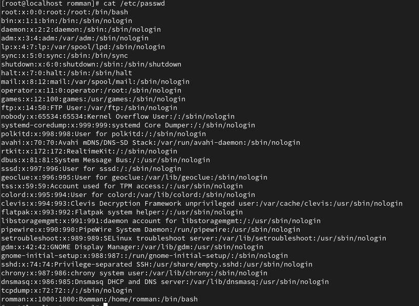
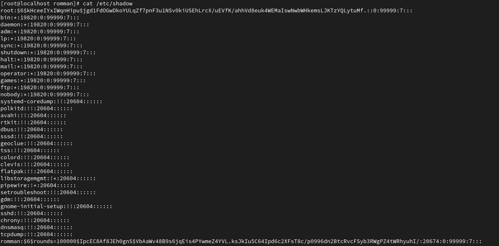

# Permission

A file permission is split into 3 groups. Each group is split into 3 bits.

\--- --- --- 

The first octet is for the user level. \
The second octect is for the group level. \
The third octect is for the others.

For example:
```
rwx rwx rwx # this means that user, user group, and others have full permission.
rwx r-- --- # This means that the user has full permission, the user group has read only, and others have no permission.
```

each permission is counted as 1 and no permission is counted 0. `rw-` is translated to `110` which is 6. `r--` is translated to `100` which means 4. So a full permission `rwxrwxrwx` means `777`.


## Change permission

To change permission for a file we use the command `chmod`.

### On an octect level

```
chmod u+w file_name
chmod g-r file_name
```

### Permission level

```
chmod +x file_name
chmod -w file_name
```

### All at once

```
chmod 644 file_name
chmod 777 file_name
```

### Note

Directories need `x` permission to be able to cd into them. 

# Users and Group Management

## Users

In linux there are 3 types of users.

1. Superuser
2. Regular
3. System

### Superuser

It has full permission to do whatever it wants. The superuser is called `root`. Be careful with who has access to this user. It is installed by default when you install the OS.

### Regular

Regular users are the standard users. They have their own home directories under `/home` and they can create files and directories in it. They can perform standard tasks based on the permission system.

### System

Installed services sometimes are installed with their own user. You don't use it to login, but they are used for these services to interact with the system and to stay isolated.


## /etc

In the older days of linux, passwords were saved in `/etc/passwd`. Later, more security concerns were raised and a new architecture was placed.

### /etc/passwd

`/etc/passwd` is still used in RHEL and other distributions. It contains many information about the user.

| Field       | Description                                                                                         |
| ----------- | --------------------------------------------------------------------------------------------------- |
| User        | This field contains the username                                                                    |
| Password    | This field used to store information about the password, but now it has been moved to `/etc/shadow` |
| UID         | The User ID                                                                                         |
| GID         | The Group ID                                                                                        |
| User Info   | Optional Description about the user                                                                 |
| Home Dir    | The home directory of the user. By default it is `/home/username`                                   |
| Login Shell | The login shell of the user. By default it is `/bin/bash`.                                          |



### /etc/shadow

This file contains more information about the password of each user. There must be an `x` in the password field in `/etc/passwd` for the user to have a record in this file.

| Field                         | Description                                                                   |
| ----------------------------- | ----------------------------------------------------------------------------- |
| User                          | This field contains the username                                              |
| Password                      | The encrypted password                                                        |
| Date of last password changed | in days after 1970-01-01                                                      |
| minimum password age          | Number of days that the password must stay before changing it                 |
| Maximum password age          | Number of days until the password must be changed                             |
| Password warning period       | Number of days before a warning is given to change the password               |
| Password inactivity period    | Number of days after password expiration which the password is still accepted |
| Account expiration date       | Number of days after which the password is expired, since 1970-01-01          |
| Reserved field                | Reserved field for future use                                                 |

In the password field, $6 means that the password is protected using the 512-bit secure hash algorithm (SHA-512). And a `*` means that this user has no password. You cannot login using this user.



### /etc/group

